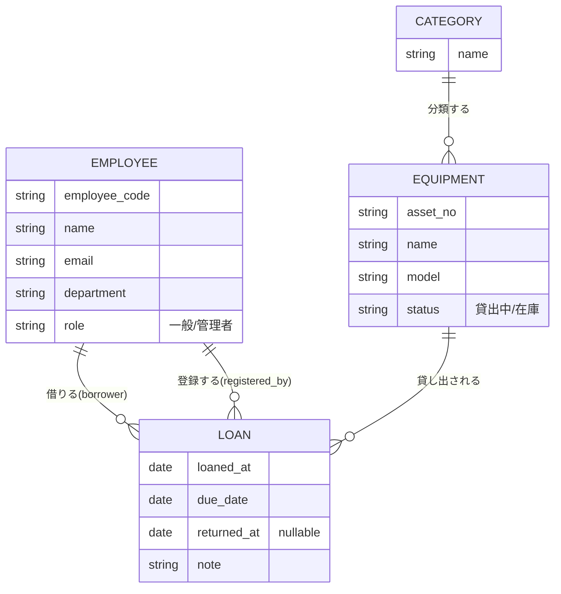

# 備品貸出管理アプリ データモデリング
## 概念設計 → 論理設計 → 物理設計

整理日：2026年9月6日
用途：データモデリングの題材整理、ER図・DDLのリファレンス

---

## 0. 要件サマリー

ヒアリングで確定した業務ルール。

| 論点 | 決定事項 |
|---|---|
| 利用者範囲 | 社内従業員のみ |
| 備品の管理粒度 | 個体管理（資産番号単位）。品目/型番マスタは持たず、個体に直接情報を持たせる |
| 保管場所 | 管理しない（単一拠点） |
| 備品ステータス | 「貸出中」「在庫」の2状態のみ |
| カテゴリ | マスタテーブルとして管理 |
| 貸出の承認フロー | 不要。その場で登録 |
| 貸出登録の操作者 | 管理者・受付が代行登録（借り手本人とは別人） |
| 延滞管理 | 必要。ただし通知は画面上の一覧表示のみ（送信ログは持たない） |
| 予約機能 | 今回は対象外（将来拡張） |
| 従業員情報 | 氏名・社員番号・メール・所属部署（部署はマスタ化せず自由入力） |

---

## 1. 概念設計 — エンティティと関連

### エンティティ

| エンティティ | 説明 |
|---|---|
| 従業員 (Employee) | 備品を借りる人。管理者・受付も同じテーブルの役割違い（role）として表現 |
| カテゴリ (Category) | 備品の分類マスタ（PC類、工具類など） |
| 備品 (Equipment) | 資産番号で個体管理される貸出対象そのもの |
| 貸出記録 (Loan) | 「誰が」「いつ」「何を」借りたか／返したかの履歴 |

### 関連

- カテゴリ 1 ── N 備品
- 従業員 1 ── N 貸出記録（**借り手**として）
- 従業員 1 ── N 貸出記録（**登録担当者**として）※同じ従業員テーブルへの2つの異なる役割の参照
- 備品 1 ── N 貸出記録（1つの備品は履歴として複数回貸し出される）



> 従業員 → 貸出記録 の関連が「借りる」「登録する」という2本の別ロールで存在する点が、この業務の一番の特徴。承認フローが無いため、登録者は借り手本人と一致しないことが常態（管理者・受付が代行登録するため）。

---

## 2. 論理設計 — 属性・キー・制約

### Employee（従業員）

| 属性 | 型（論理） | 制約 |
|---|---|---|
| employee_id | 整数 | PK（サロゲートキー） |
| employee_code | 文字列 | UNIQUE, NOT NULL（社員番号／業務キー） |
| name | 文字列 | NOT NULL |
| email | 文字列 | UNIQUE, NOT NULL |
| department | 文字列 | NULL可（マスタ化せず自由入力） |
| role | 列挙（一般/管理者） | NOT NULL, デフォルト「一般」 |

### Category（カテゴリ）

| 属性 | 型 | 制約 |
|---|---|---|
| category_id | 整数 | PK |
| name | 文字列 | UNIQUE, NOT NULL |

### Equipment（備品）

| 属性 | 型 | 制約 |
|---|---|---|
| equipment_id | 整数 | PK |
| asset_no | 文字列 | UNIQUE, NOT NULL（資産番号／業務キー） |
| name | 文字列 | NOT NULL |
| model | 文字列 | NULL可 |
| category_id | 整数 | FK → Category, NOT NULL |
| status | 列挙（在庫/貸出中） | NOT NULL, デフォルト「在庫」（貸出・返却の都度アプリ／トリガーで更新する冗長データ） |

### Loan（貸出記録）

| 属性 | 型 | 制約 |
|---|---|---|
| loan_id | 整数 | PK |
| equipment_id | 整数 | FK → Equipment, NOT NULL |
| borrower_employee_id | 整数 | FK → Employee, NOT NULL（借り手） |
| registered_by_employee_id | 整数 | FK → Employee, NOT NULL（登録担当者） |
| loaned_at | 日時 | NOT NULL |
| due_date | 日付 | NOT NULL |
| returned_at | 日時 | NULL可（未返却＝NULL） |
| note | 文字列（長め） | NULL可 |

### 業務ルール（物理設計で担保する）

1. 同一備品の「未返却」貸出記録（`returned_at IS NULL`）は、常に高々1件までしか存在できない。
2. `due_date` は `loaned_at` の日付以降でなければならない。
3. `equipment.status` は貸出登録・返却登録のタイミングで必ず同期させる（冗長データゆえ不整合が起きないよう責務を明確にする）。
4. 延滞判定は `status = '貸出中' AND due_date < 今日` の導出条件で行い、専用の通知テーブルは持たない。

---

## 3. 物理設計 — PostgreSQL

対象：小規模（備品数百件・従業員数十〜数百人）／PostgreSQL／主キーは連番整数（IDENTITY）。

設計判断のポイント：

- **role / status** はENUM型ではなく `varchar + CHECK制約`。将来値を増やす際に `ALTER TYPE` の制約（トランザクション内での追加不可など）を避けられる。
- **「未返却は備品につき1件まで」** は `WHERE returned_at IS NULL` の部分ユニークインデックスで、DBレベルで二重貸出を物理的に防止する。
- **equipment.status の同期** は、アプリ側の実装ミスによる不整合を防ぐため、トリガーでDBが自動更新する。
- **延滞一覧** はビューとして提供し、アプリはSELECTするだけでよい。

```sql
-- 従業員
CREATE TABLE employee (
    employee_id     integer GENERATED ALWAYS AS IDENTITY PRIMARY KEY,
    employee_code   varchar(20)  NOT NULL UNIQUE,
    name            varchar(100) NOT NULL,
    email           varchar(255) NOT NULL UNIQUE,
    department      varchar(100),
    role            varchar(10)  NOT NULL DEFAULT 'staff'
                       CHECK (role IN ('staff', 'admin')),
    created_at      timestamptz  NOT NULL DEFAULT now(),
    updated_at      timestamptz  NOT NULL DEFAULT now()
);

-- カテゴリマスタ
CREATE TABLE category (
    category_id     integer GENERATED ALWAYS AS IDENTITY PRIMARY KEY,
    name            varchar(100) NOT NULL UNIQUE
);

-- 備品
CREATE TABLE equipment (
    equipment_id    integer GENERATED ALWAYS AS IDENTITY PRIMARY KEY,
    asset_no        varchar(50)  NOT NULL UNIQUE,
    name            varchar(200) NOT NULL,
    model           varchar(200),
    category_id     integer NOT NULL REFERENCES category(category_id),
    status          varchar(10) NOT NULL DEFAULT 'in_stock'
                       CHECK (status IN ('in_stock', 'on_loan')),
    created_at      timestamptz NOT NULL DEFAULT now(),
    updated_at      timestamptz NOT NULL DEFAULT now()
);
CREATE INDEX idx_equipment_category ON equipment(category_id);
CREATE INDEX idx_equipment_status   ON equipment(status);

-- 貸出記録
CREATE TABLE loan (
    loan_id                    integer GENERATED ALWAYS AS IDENTITY PRIMARY KEY,
    equipment_id               integer NOT NULL REFERENCES equipment(equipment_id),
    borrower_employee_id       integer NOT NULL REFERENCES employee(employee_id),
    registered_by_employee_id  integer NOT NULL REFERENCES employee(employee_id),
    loaned_at                  timestamptz NOT NULL DEFAULT now(),
    due_date                   date NOT NULL,
    returned_at                timestamptz,
    note                       text,
    CHECK (due_date >= loaned_at::date)
);

-- 同一備品につき「未返却」は同時に1件まで
CREATE UNIQUE INDEX uq_loan_open_per_equipment
    ON loan(equipment_id)
    WHERE returned_at IS NULL;

CREATE INDEX idx_loan_borrower ON loan(borrower_employee_id);
CREATE INDEX idx_loan_overdue  ON loan(due_date) WHERE returned_at IS NULL;

-- 貸出/返却時に equipment.status を自動同期するトリガー
CREATE OR REPLACE FUNCTION sync_equipment_status() RETURNS trigger AS $$
BEGIN
    IF TG_OP = 'INSERT' THEN
        UPDATE equipment SET status = 'on_loan', updated_at = now()
        WHERE equipment_id = NEW.equipment_id;
    ELSIF TG_OP = 'UPDATE' AND NEW.returned_at IS NOT NULL AND OLD.returned_at IS NULL THEN
        UPDATE equipment SET status = 'in_stock', updated_at = now()
        WHERE equipment_id = NEW.equipment_id;
    END IF;
    RETURN NEW;
END;
$$ LANGUAGE plpgsql;

CREATE TRIGGER trg_sync_equipment_status
AFTER INSERT OR UPDATE ON loan
FOR EACH ROW EXECUTE FUNCTION sync_equipment_status();

-- 延滞一覧ビュー
CREATE VIEW overdue_loans AS
SELECT
    l.loan_id,
    e.asset_no,
    e.name          AS equipment_name,
    emp.name        AS borrower_name,
    l.due_date,
    CURRENT_DATE - l.due_date AS days_overdue
FROM loan l
JOIN equipment e   ON e.equipment_id = l.equipment_id
JOIN employee emp  ON emp.employee_id = l.borrower_employee_id
WHERE l.returned_at IS NULL
  AND l.due_date < CURRENT_DATE;
```

---

## 参考：図版

3段階のER図と、トリガー・部分ユニークインデックスの仕組み図をまとめたページ（Artifact）：
https://claude.ai/code/artifact/dfca8c2b-32a7-4b11-a998-cef63714abe7

## 今後の拡張候補

- 予約機能（貸出前の事前予約テーブル）
- 保管場所・拠点管理（複数拠点化した場合）
- 備品ステータスの多様化（故障中・修理中・廃棄済みなど）
- 延滞メール自動送信と通知ログ
